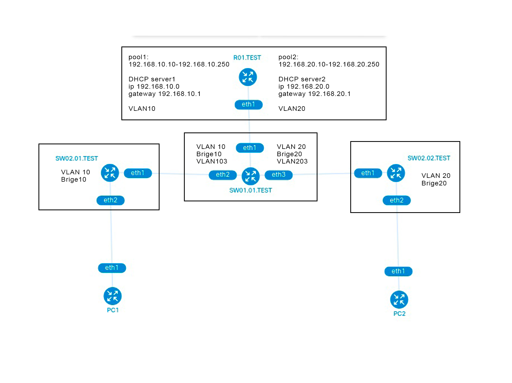

University: [ITMO University](https://itmo.ru/ru/)

Faculty: [FICT](https://fict.itmo.ru)

Course: [Introduction in routing](https://github.com/itmo-ict-faculty/introduction-in-routing)

Year: 2022/2023

Group: K33212

Author: Sobolevskaya Nadezhda Sergeevna

Lab: Lab1

Date of create: 18.09.2022

Date of finished: 11.12.2022


# Отчет по лабораторной работе №1: "Установка ContainerLab и развертывание тестовой сети связи"

## Цель работы

Ознакомиться с инструментом ContainerLab и методами работы с ним, изучить работу VLAN, IP адресации и т.д.

## Ход работы
#### 1. Содержимое файла lab1.clab.yaml для развертывания виртуальной сети:
```
name: lab1

mgmt:
  network: statics
  ipv4_subnet: 192.11.11.0/24

topology:
  nodes:
    R01.TEST:
      kind: vr-ros
      image: vrnetlab/vr-routeros:6.47.9
      mgmt_ipv4: 192.11.11.2

    SW01.01.TEST:
      kind: vr-ros
      image: vrnetlab/vr-routeros:6.47.9
      mgmt_ipv4: 192.11.11.3

    SW02.01.TEST:
      kind: vr-ros
      image: vrnetlab/vr-routeros:6.47.9
      mgmt_ipv4: 192.11.11.4

    SW02.02.TEST:
      kind: vr-ros
      image: vrnetlab/vr-routeros:6.47.9
      mgmt_ipv4: 192.11.11.5

    PC1:
      kind: linux
      image: ubuntu:latest
      mgmt_ipv4: 192.11.11.6

    PC2:
      kind: linux
      image: ubuntu:latest
      mgmt_ipv4: 192.11.11.7

  links: 
    - endpoints: ["R01.TEST:eth1", "SW01.01.TEST:eth1"]
    - endpoints: ["SW01.01.TEST:eth2", "SW02.01.TEST:eth1"]
    - endpoints: ["SW01.01.TEST:eth3", "SW02.02.TEST:eth1"]
    - endpoints: ["SW02.01.TEST:eth2", "PC1:eth1"]
    - endpoints: ["SW02.02.TEST:eth2", "PC2:eth1"]  

```
#### 2. Схема сети:


#### 3. Разворачивание сети

Видим список устройств и их адреса для подключения по ssh admin@192...

#### 4. Export конфигураций сетевых устройств:

- R01.TEST 

- SW01.01.TEST

- SW02.01.TEST

- SW02.02.TEST


#### 5. Ping адресов устройств:


#### 6. Вывод
В ходе данной лабораторной работы были освоены методы работы с ContainerLab, была изучена работа VLAN, IP адресация и т.д.
