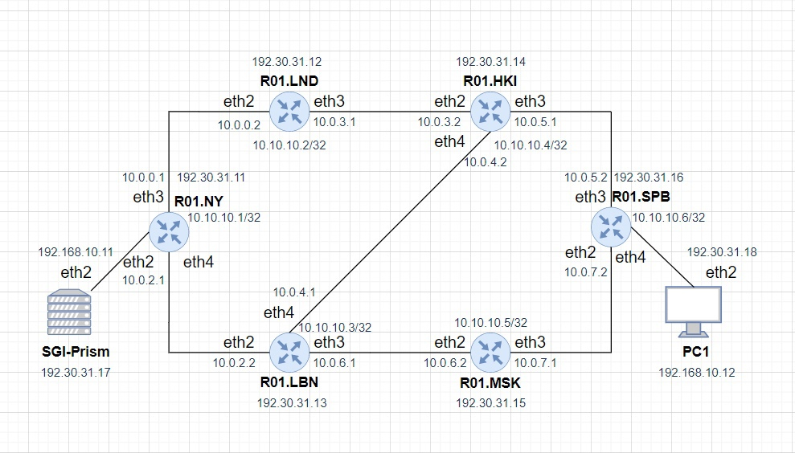

University: [ITMO University](https://itmo.ru/ru/)

Faculty: [FICT](https://fict.itmo.ru)

Course: [Introduction in routing](https://github.com/itmo-ict-faculty/introduction-in-routing)

Year: 2022/2023

Group: K33212

Author: Sobolevskaya Nadezhda Sergeevna

Lab: Lab3

Date of create: xx.xx.2022

Date of finished: xx.xx.2022

# Отчет по лабораторной работе №3 "Эмуляция распределенной корпоративной сети связи, настройка OSPF и MPLS, организация первого EoMPLS"

## Цель работы

Изучить протоколы OSPF и MPLS, механизмы организации EoMPLS.

## Схема сети


## Ход работы
#### 1. Содержимое файла lab03.clab.yaml для развертывания виртуальной сети:
#### 2. Разворачивание сети
Видим список устройств и их адреса для подключения по ssh

#### 3. Настройка сетевых устройств. Export конфигураций.

- R01.NY
```
/interface bridge
add name=EoMPLS_bridge
add name=loopback
/interface vpls
add cisco-style=yes cisco-style-id=222 disabled=no l2mtu=1500 mac-address=02:90:6A:B9:96:C8 name=EoMPLS \
	remote-peer=10.10.10.6
/interface wireless security-profiles
set [ find default=yes ] supplicant-identity=MikroTik
/routing ospf instance
set [ find default=yes ] router-id=10.10.10.1
/interface bridge port
add bridge=EoMPLS_bridge interface=ether2
add bridge=EoMPLS_bridge interface=EoMPLS
/ip address
add address=172.31.255.30/30 interface=ether1 network=172.31.255.28
add address=10.0.0.1/30 interface=ether3 network=10.0.0.0
add address=10.0.2.1/30 interface=ether4 network=10.0.2.0
add address=10.10.10.1 interface=loopback network=10.10.10.1
/ip dhcp-client
add disabled=no interface=ether1
/mpls ldp
set enabled=yes transport-address=10.10.10.1
/mpls ldp interface
add interface=ether3
add interface=ether4
/routing ospf network
add area=backbone
/system identity
set name=R01.NY
```

- R01.LND
```
/interface bridge
add name=Lo0
/interface wireless security-profiles
set [ find default=yes ] supplicant-identity=MikroTik
/routing ospf instance
set [ find default=yes ] router-id=2.2.2.2
/ip address
add address=172.31.255.30/30 interface=ether1 network=172.31.255.28
add address=10.0.1.2/30 interface=ether2 network=10.0.1.0
add address=10.0.3.1/30 interface=ether3 network=10.0.3.0
add address=2.2.2.2 interface=Lo0 network=2.2.2.2
/ip dhcp-client
add disabled=no interface=ether1
/mpls ldp
set enabled=yes transport-address=2.2.2.2
/mpls ldp interface
add interface=ether2
add interface=ether3
/routing ospf network
add area=backbone
/system identity
set name=R01.LND
```

- R01.LBN
```
/interface bridge
add name=Lo0
/interface wireless security-profiles
set [ find default=yes ] supplicant-identity=MikroTik
/routing ospf instance
set [ find default=yes ] router-id=3.3.3.3
/ip address
add address=172.31.255.30/30 interface=ether1 network=172.31.255.28
add address=10.0.2.2/30 interface=ether2 network=10.0.2.0
add address=10.0.4.1/30 interface=ether3 network=10.0.4.0
add address=10.0.5.1/30 interface=ether4 network=10.0.5.0
add address=3.3.3.3 interface=Lo0 network=3.3.3.3
/ip dhcp-client
add disabled=no interface=ether1
/mpls ldp
set enabled=yes transport-address=3.3.3.3
/mpls ldp interface
add interface=ether2
add interface=ether3
add interface=ether4
/routing ospf network
add area=backbone
/system identity
set name=R01.LBN
```

- R01.HKI
```
/interface bridge
add name=Lo0
/interface wireless security-profiles
set [ find default=yes ] supplicant-identity=MikroTik
/routing ospf instance
set [ find default=yes ] router-id=4.4.4.4
/ip address
add address=172.31.255.30/30 interface=ether1 network=172.31.255.28
add address=10.0.3.2/30 interface=ether2 network=10.0.3.0
add address=10.0.6.1/30 interface=ether3 network=10.0.6.0
add address=10.0.5.2/30 interface=ether4 network=10.0.5.0
add address=4.4.4.4 interface=Lo0 network=4.4.4.4
/ip dhcp-client
add disabled=no interface=ether1
/mpls ldp
set enabled=yes transport-address=4.4.4.4
/mpls ldp interface
add interface=ether2
add interface=ether3
add interface=ether4
/routing ospf network
add area=backbone
/system identity
set name=R01.HKI
```

- R01.MSK
```
/interface bridge
add name=Lo0
/interface wireless security-profiles
set [ find default=yes ] supplicant-identity=MikroTik
/routing ospf instance
set [ find default=yes ] router-id=5.5.5.5
/ip address
add address=172.31.255.30/30 interface=ether1 network=172.31.255.28
add address=10.0.4.2/30 interface=ether2 network=10.0.4.0
add address=10.0.7.1/30 interface=ether3 network=10.0.7.0
add address=5.5.5.5 interface=Lo0 network=5.5.5.5
/ip dhcp-client
add disabled=no interface=ether1
/mpls ldp
set enabled=yes transport-address=5.5.5.5
/mpls ldp interface
add interface=ether2
add interface=ether3
/routing ospf network
add area=backbone
/system identity
set name=R01.MSK
```

- R01.SPB
```
/interface bridge
add name=EoMPLS_B
add name=Lo0
/interface vpls
add cisco-style=yes cisco-style-id=100 disabled=no l2mtu=1500 mac-address=02:2D:EA:16:D6:9A name=EoMPLS \
	remote-peer=1.1.1.1
/interface wireless security-profiles
set [ find default=yes ] supplicant-identity=MikroTik
/routing ospf instance
set [ find default=yes ] router-id=6.6.6.6
/interface bridge port
add bridge=EoMPLS_B interface=ether4
add bridge=EoMPLS_B interface=EoMPLS
/ip address
add address=172.31.255.30/30 interface=ether1 network=172.31.255.28
add address=10.0.7.2/30 interface=ether2 network=10.0.7.0
add address=10.0.6.2/30 interface=ether3 network=10.0.6.0
add address=6.6.6.6 interface=Lo0 network=6.6.6.6
/ip dhcp-client
add disabled=no interface=ether1
/mpls ldp
set enabled=yes transport-address=6.6.6.6
/mpls ldp interface
add interface=ether2
add interface=ether3
/routing ospf network
add area=backbone
/system identity
set name=R01.SPB
```

- SGI-Prism
```
/interface wireless security-profiles
set [ find default=yes ] supplicant-identity=MikroTik
/ip address
add address=172.31.255.30/30 interface=ether1 network=172.31.255.28
add address=192.168.10.11/24 interface=ether2 network=192.168.10.0
/ip dhcp-client
add disabled=no interface=ether1
/system identity
set name=SGI-Prism
```

- PC1
```
/interface wireless security-profiles
set [ find default=yes ] supplicant-identity=MikroTik
/ip address
add address=172.31.255.30/30 interface=ether1 network=172.31.255.28
add address=192.168.10.12/24 interface=ether2 network=192.168.10.0
/ip dhcp-client
add disabled=no interface=ether1
/system identity
set name=PC1
```

